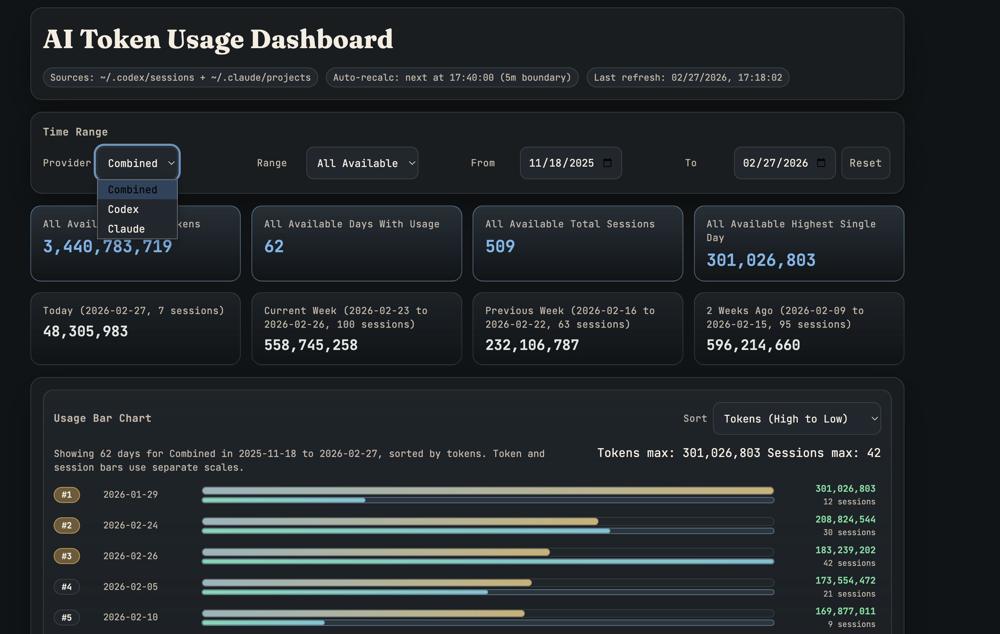

# Codex Token Usage Dashboard

A local HTML dashboard for Codex and Claude token usage that auto-recalculates on refresh from local session data.

## Dashboard Screenshot



## Features

- Provider toggle (`Combined`, `Codex`, `Claude`)
- YTD stats cards (`YTD total`, `days`, `sessions`, `highest day`)
- Today + calendar-week rollups
- Daily breakdown table sorted by highest total tokens
- Horizontal bar chart (with rank, total tokens, and session count) above the table
- Auto-recalc on browser refresh and every 5 minutes via local `localhost` endpoint

## Project Structure

- `dashboard/index.html`: Dashboard UI
- `scripts/codex_usage_recalc_server.py`: Local HTTP recalc service (`/health`, `/recalc`)
- `scripts/run_local.sh`: Convenience launcher for local development
- `launchd/*.plist.example`: Optional macOS LaunchAgent template

## Requirements

- macOS or Linux
- Python 3.9+
- Local Codex session logs in `~/.codex/sessions`
- Local Claude project logs in `~/.claude/projects` (optional; dashboard still works without Claude data)

## Quick Start

1. Start the local recalc service:

```bash
cd /path/to/codex-token-usage-dashboard
chmod +x scripts/run_local.sh
./scripts/run_local.sh
```

2. Open the dashboard:

```bash
open http://127.0.0.1:8765/
```

3. Refresh the page.
   - On refresh, `index.html` calls `/recalc` on the same localhost server
   - The service rewrites dashboard stats/table and the page reloads with fresh values

## Configuration

Environment variables:

- `CODEX_USAGE_SERVER_HOST` (default: `127.0.0.1`)
- `CODEX_USAGE_SERVER_PORT` (default: `8765`)
- `CODEX_USAGE_SESSIONS_ROOT` (default: `~/.codex/sessions`)
- `CODEX_USAGE_CLAUDE_PROJECTS_ROOT` (default: `~/.claude/projects`)
- `CODEX_USAGE_DASHBOARD_HTML` (default: `<repo>/dashboard/index.html`)

## Optional: Run as LaunchAgent (macOS)

1. Copy and edit the template:

```bash
cp launchd/com.user.codex-token-dashboard-recalc.plist.example \
  ~/Library/LaunchAgents/com.user.codex-token-dashboard-recalc.plist
```

2. Replace placeholder absolute paths.

3. Load it:

```bash
launchctl bootstrap gui/$(id -u) ~/Library/LaunchAgents/com.user.codex-token-dashboard-recalc.plist
launchctl kickstart -k gui/$(id -u)/com.user.codex-token-dashboard-recalc
```

4. Verify:

```bash
curl http://127.0.0.1:8765/health
```

## Notes

- The dashboard is designed for local use and reads local Codex and Claude session logs.
- Claude request usage is deduplicated by `(sessionId, requestId)` and keeps the highest observed `output_tokens` for the request.
- Claude total token metric is computed as `input_tokens + cache_creation_input_tokens + cache_read_input_tokens + output_tokens`.
- No third-party services are required.

## Use as a Codex Skill

This repo is skill-ready and includes:
- `SKILL.md` (trigger metadata + workflow instructions)
- `agents/openai.yaml` (skill UI metadata)

### Local install (from filesystem)

```bash
mkdir -p ~/.codex/skills
ln -sfn /absolute/path/to/codex-token-usage-dashboard \
  ~/.codex/skills/codex-token-usage-dashboard
```

Restart Codex after installation.

### Invoke in Codex

Ask with the skill name, for example:

```text
Use $codex-token-usage-dashboard to recalc and update my usage dashboard.
```
