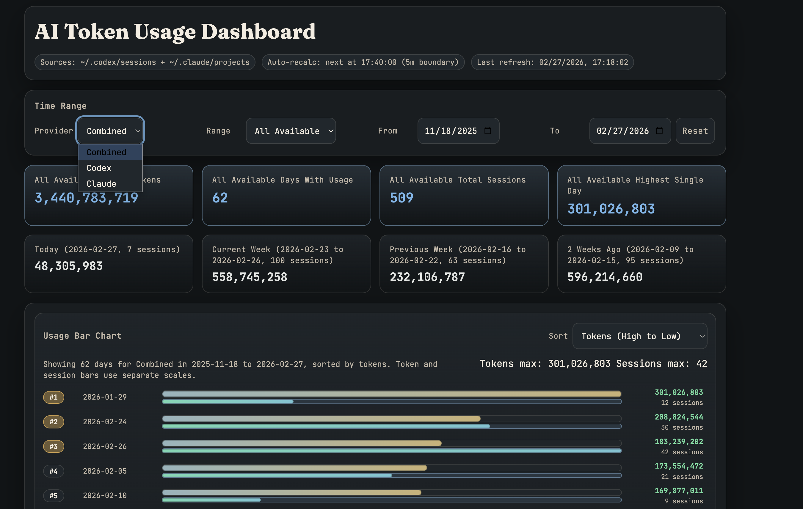

# AI Token Usage Dashboard

A local HTML dashboard for multi-provider AI token usage that auto-recalculates on refresh from local session data.
Supports Codex, Claude, and PI Coding Agent.

## Dashboard Screenshot



## Features

- Provider toggle filtered to providers present on the system (`Combined`, `Codex`, `Claude`, `PI`)
- Range-aware stats cards for total, days, sessions, highest day, explicit input/output/total token totals, and cost totals
- Today + calendar-week rollups
- Activity Rhythm heatmap + time-of-day summary for the selected provider and date range
- Daily breakdown table with sessions, input, output, cached, total token, and total cost columns
- Range-scoped breakdown table grouped by `Agent CLI` + `Model`, including cost totals
- Horizontal bar chart (with rank, total tokens, and session count) above the table
- Auto-recalc on browser refresh and every 5 minutes via local `localhost` endpoint
- Compact tmux status rendering for Today/MTD total tokens, MTD cost, and ChatGPT subscription quota/reset information via `scripts/render_tmux_status.py`, aligned to 5-minute refresh boundaries

## Project Structure

- `dashboard/index.html`: Dashboard UI
- `scripts/ai_usage_recalc_server.py`: Thin local HTTP recalc service (`/health`, `/recalc`)
- `scripts/dashboard_core/config.py`: Runtime config/env resolution
- `scripts/dashboard_core/chatgpt_subscription.py`: Credential-safe Codex app-server adapter for ChatGPT plan and quota data
- `scripts/dashboard_core/collectors.py`: Codex/Claude/PI usage ingestion
- `scripts/dashboard_core/aggregation.py`: Daily aggregation + date window logic
- `scripts/dashboard_core/render.py`: HTML rewrite + dataset injection
- `scripts/dashboard_core/pipeline.py`: End-to-end recalc orchestration
- `scripts/dashboard_core/pricing.py`: Built-in rate card + optional pricing override loader
- `scripts/dashboard_core/tmux_status.py`: Compact status snapshot + string formatting helpers for tmux
- `scripts/render_tmux_status.py`: Cache-aware tmux status renderer that refreshes dashboard data on demand
- `scripts/run_local.sh`: Convenience launcher for local development
- `scripts/tests/test_harness_contracts.py`: Deterministic pipeline/harness invariants
- `launchd/*.plist.example`: Optional macOS LaunchAgent template
- `docs/harness-engineering-adoption.md`: Harness-engineering rationale + validation loop

## Requirements

- macOS or Linux
- Python 3.9+
- Local Codex session logs in `~/.codex/sessions`
- Codex CLI signed in with ChatGPT for subscription quota display (optional; token and cost status still works without it)
- Local Claude project logs in `~/.claude/projects` (optional; dashboard still works without Claude data)
- Local PI agent state in `~/.pi/agent` (optional; dashboard still works without PI data)

## Quick Start

1. Start the local recalc service:

```bash
cd /path/to/ai-token-usage-dashboard
chmod +x scripts/run_local.sh
./scripts/run_local.sh
```

2. Open the dashboard:

```bash
open http://127.0.0.1:8765/
```

3. Refresh the page.
   - On refresh, the dashboard calls `/recalc` on the same localhost server
   - By default, the service rewrites `tmp/index.runtime.html` (untracked), so git-tracked `dashboard/index.html` stays unchanged
   - The page reloads with fresh values after recalc completes

## Configuration

Environment variables:

- `AI_USAGE_SERVER_HOST` (default: `127.0.0.1`)
- `AI_USAGE_SERVER_PORT` (default: `8765`)
- `AI_USAGE_CODEX_SESSIONS_ROOT` (default: `~/.codex/sessions`)
- `AI_USAGE_CLAUDE_PROJECTS_ROOT` (default: `~/.claude/projects`)
- `AI_USAGE_PI_AGENT_ROOT` (default: `~/.pi/agent`)
- `AI_USAGE_DASHBOARD_HTML` (default via `scripts/run_local.sh`: `<repo>/tmp/index.runtime.html`, seeded from `<repo>/dashboard/index.html`)
- `AI_USAGE_PRICING_FILE` (optional JSON rate-card override file merged over the built-in pricing table)
- `AI_USAGE_RECALC_LOG_FILE` (optional JSONL file for persistent `/recalc` timing/error logs; default: `<repo>/tmp/recalc_timings.jsonl`)
- `AI_USAGE_CHATGPT_USAGE` (`auto` or `off`; default: `auto`)
- `AI_USAGE_CODEX_BIN` (Codex executable used for the app-server account API; default: `codex`)
- `AI_USAGE_CHATGPT_TIMEOUT_SECONDS` (overall account/quota request timeout; default: `3`)

## Tmux Status Line

You can surface a compact AI usage pulse directly in tmux.

Compact ChatGPT subscription format at the recommended 96-character budget:

```text
GPT Pro · 5h 72% ↻14:35 · 7d 61% ↻Fri 09:00 · Today 13.3M · MTD 934.7M · $753
```

Where:
- `GPT Pro` is the detected ChatGPT plan; it is omitted for API-key, Bedrock, signed-out, or disabled account usage
- `5h` and `7d` are the primary and weekly Codex quota windows, expressed as percent remaining
- a fully reset, inactive five-hour window remains visible as `5h 100%` when the Codex endpoint temporarily omits it; an active value is never replaced with this fallback
- `↻` shows each active quota's reset in local time; both reset times remain visible in the normal 96-character presentation
- `Today` and `MTD` are total tokens; input/output details are intentionally omitted
- the amount after the MTD token total is the locally derived month-to-date cost estimate, not an additional ChatGPT subscription charge
- middle dots consistently separate plan, quota, token, and cost values
- healthy status text is omitted; `partial`, `stale`, or `error` appears only when attention is needed

### How it works

- tmux redraws the status every few seconds
- `scripts/render_tmux_status.py` only recalculates when crossing a 5-minute boundary (`:00`, `:05`, `:10`, ...)
- in `auto` mode, the renderer uses the stable Codex app-server `account/read` and `account/rateLimits/read` methods; it never reads OAuth credentials directly
- the status renderer caches normalized local metrics and quota data in `tmp/tmux_status.json`
- a quota request has a hard timeout; the last successful quota remains visible as stale data without breaking token/cost status
- a more constrained named model quota is added only when it is tighter than the general Codex quota
- if neither provider data nor a usable ChatGPT quota is available, it falls back to `AI unavailable`

### Toggle in tmux

The tmux config supports enabling/disabling the AI segment with a user option and key binding:

- `set -g @ai_token_usage_status 1` → enabled
- `set -g @ai_token_usage_status 0` → disabled
- `Prefix + A` toggles it live

Example command to preview the segment outside tmux:

```bash
python3 scripts/render_tmux_status.py --refresh-interval-minutes 5 --max-width 96
```

Disable ChatGPT account lookups while retaining total tokens and MTD cost:

```bash
python3 scripts/render_tmux_status.py --chatgpt-usage off --max-width 96
```

## Optional: Run as LaunchAgent (macOS)

1. Copy and edit the template:

```bash
cp launchd/com.user.ai-token-usage-dashboard-recalc.plist.example \
  ~/Library/LaunchAgents/com.user.ai-token-usage-dashboard-recalc.plist
```

2. Replace placeholder absolute paths.

3. Load it:

```bash
launchctl bootstrap gui/$(id -u) ~/Library/LaunchAgents/com.user.ai-token-usage-dashboard-recalc.plist
launchctl kickstart -k gui/$(id -u)/com.user.ai-token-usage-dashboard-recalc
```

4. Verify:

```bash
curl http://127.0.0.1:8765/health
```

## Notes

- The dashboard is designed for local use and reads local AI provider session logs from Codex, Claude, and PI when present.
- Daily rows in the injected dataset include `sessions`, `input_tokens`, `output_tokens`, `cached_tokens`, `total_tokens`, `input_cost_usd`, `output_cost_usd`, `cached_cost_usd`, `total_cost_usd`, `cost_complete`, and `breakdown_rows` grouped by `(agent_cli, model)`.
- A built-in versioned pricing table is used for derived Codex and Claude costs, and can be overridden via `AI_USAGE_PRICING_FILE`.
- Codex usage keeps the latest `token_count` snapshot per session, extracts `originator`/`source` for the CLI bucket, uses the latest observed `turn_context.payload.model` when present, and prices uncached input separately from cached tokens.
- ChatGPT subscription status is fetched through the Codex app server, and only normalized plan/quota/reset/credit metadata is cached. Email addresses, account IDs, and OAuth tokens are neither returned nor persisted by the dashboard.
- Claude request usage is deduplicated by `(sessionId, requestId)`, keeps the highest observed token values for the request, computes `cached_tokens = cache_creation_input_tokens + cache_read_input_tokens`, and derives cost from the model rate card.
- Claude-style context attribution is extracted when transcript events expose it: Skills from `<command-message>` slash commands, Agents/Subagents from `Agent`/`Task` tool calls, MCP servers from `mcp__server__method` tools, Tools from `tool_use` blocks, and Plugins / Extensions from namespaced slash commands plus plugin/extension metadata or tool namespaces. Attribution token/cost shares are estimated from the session totals for matching transcript events.
- PI usage is read from `~/.pi/agent/sessions/**/*.jsonl`, tracks the active model via `model_change` events, computes `cached_tokens = cacheRead + cacheWrite`, prefers native `message.usage.cost.*` when present, and resumes parsing from the last verified byte offset when a session log grows append-only.
- Unmapped provider/model pricing is surfaced as partial cost in the API/UI instead of silently treated as trusted zero cost.
- `/recalc` responses expose `Server-Timing` headers and `timings_ms` in the JSON payload, and the dashboard hero shows the latest refresh timing summary for quick diagnosis.
- No third-party services are required.

## Validation

Run the full local harness checks:

```bash
python3 -m unittest discover -s scripts/tests
```

## Use as a Codex Skill

This repo is skill-ready and includes:
- `SKILL.md` (trigger metadata + workflow instructions)
- `agents/openai.yaml` (skill UI metadata)

### Local install (from filesystem)

```bash
mkdir -p ~/.codex/skills
ln -sfn /absolute/path/to/ai-token-usage-dashboard \
  ~/.codex/skills/ai-token-usage-dashboard
```

Restart Codex after installation.

### Invoke in Codex

Ask with the skill name, for example:

```text
Use $ai-token-usage-dashboard to recalc and update my usage dashboard.
```
